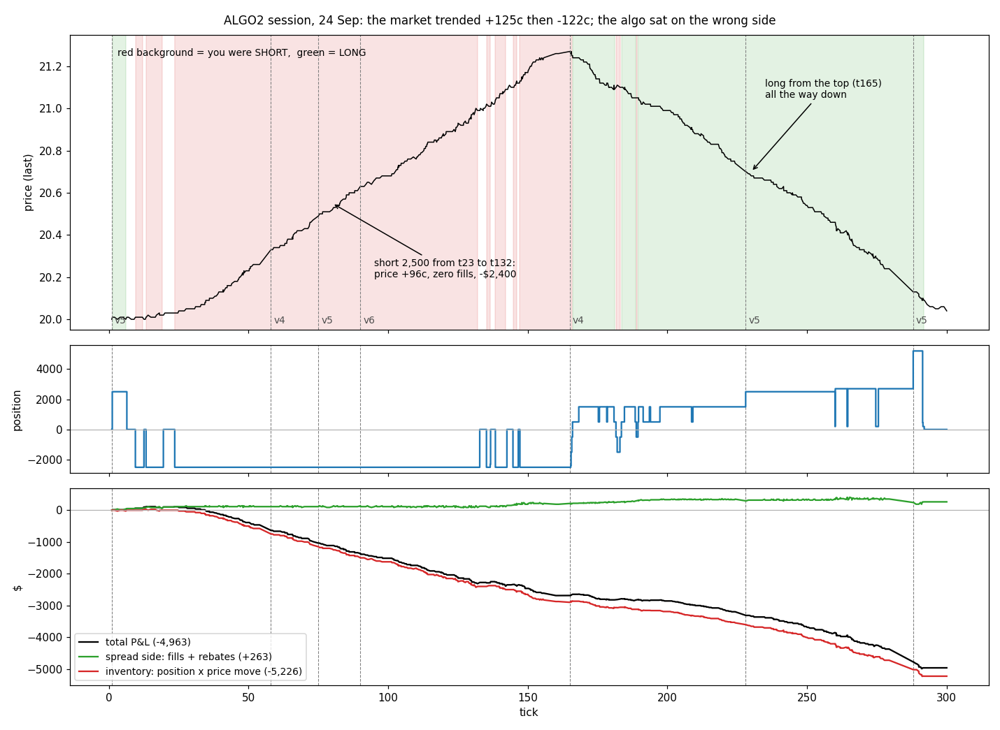
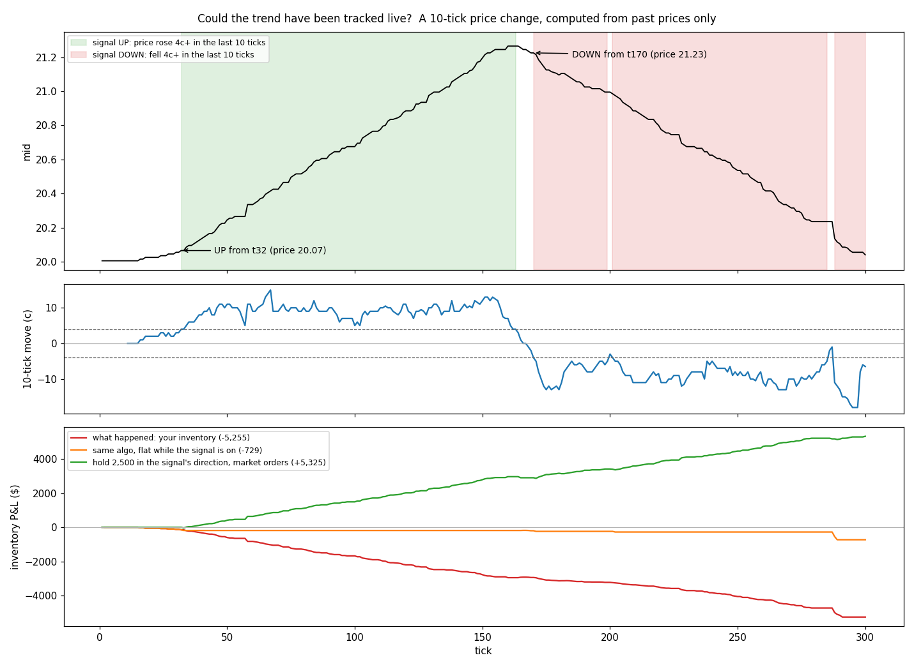
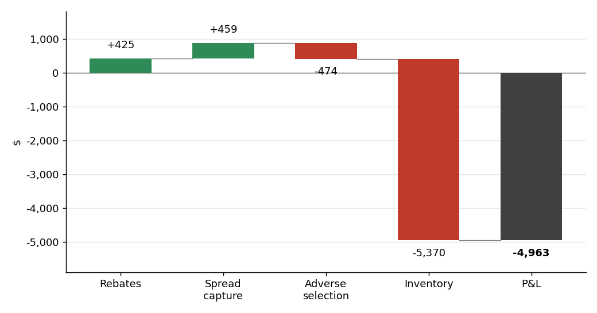

# Final Project Part 2.1: RIT ALGO2 Market Making Write-up

Jean Jacob · Individual write-up · Oct 5, 2026

## Setup and economics

ALGO2 rewards passive liquidity: a filled limit order earns about 1¢ per share against the mid, while a market order costs about 1.5¢.

The case has one stock (ALGO) traded for 300 seconds. Orders are capped at 5,000 shares, and positions at 25,000 shares gross or net, with a 10¢-per-share fine beyond that. Market orders pay a 1¢ commission; filled limit orders receive a ½¢ rebate.

| Per share, against the mid, at a 1¢ spread | Limit order (passive) | Market order (aggressive) |
| --- | --- | --- |
| Half the spread | +0.5¢ | −0.5¢ |
| Fee | +0.5¢ rebate | −1¢ commission |
| **Total** | **+1¢** | **−1.5¢** |

Two passive fills in a round trip earn 2¢ per share, and even a round trip with no price gain earns 1¢ in rebates. The goal is therefore to trade passively, as often as possible, while keeping inventory small.

## (a) What was your strategy going in?

I went in with v5: a two-sided market maker quoting at the best bid and ask, skewing its quotes against its inventory, and trading 2,500 shares per order.

I built it in versions following the brief's two rules: always keep a bid and an ask near the top of the book, resetting when one leg fills (rule 1); and keep inventory close to balanced (rule 2). Each version was tested in practice cases.

| Version | What it added | What the test showed |
| --- | --- | --- |
| v1 | The brief literally: bid at LAST − 5¢, ask at LAST + 5¢ | Orders posted twice and never moved; one leg sat unfilled for 96 ticks |
| v2 | Seven fixes: side-aware state, wait for confirmation, a requote rule, the mid instead of LAST, logging | Sound mechanics |
| v3 | Quotes at the best price: join when the spread is under 3¢, improve by 1¢ otherwise | Frequent fills, but long 13,000 shares after a 5¢ drop: no inventory control |
| v4 | Inventory skew of 1¢ per 1,000 shares, soft limit of 10,000, passive unwind from tick 280 | Unwound 12,000 shares passively; $3.8 per tick |
| v5 | 2,500 shares per order; quotes near the mid when the spread is 4¢ or wider | $3.9 per tick over two cases |
| v6 | v5 plus a step back on the exposed quote when book imbalance exceeds 0.6 | $2.5 per tick: the guard cost fills |

Three choices held across versions: the mid, not LAST, as reference price; quotes never crossing the spread; and moving only the leg that is off target. Market orders were used only to flatten in the last 5 ticks.

I chose v5 because it earned as much per tick as v4 over a larger sample (212 ticks, two cases), with positions within ±2,500. The practice cases ended at +$898 and +$910.

## (b) How would you decide what the appropriate bid/ask spread should be? Should it be dynamic or static?

**Dynamic.** The spread I quote has to do three things, and all three change during a case: sit where the market actually trades, earn more than a fill costs me, and lean against my inventory. A static spread fails one way or the other. If it is wide enough to be safe in a fast market, it almost never fills in a calm one; if it is narrow enough to fill in a calm market, it gets run over in a fast one.

My first version shows the static failure. v1 quoted LAST ± 5¢, a fixed 10¢ spread in a market that usually traded 1¢ wide, and one leg sat unfilled for 96 ticks. A quote that far from the touch fills only when the price runs through it, which is exactly the fill a market maker does not want.

**What a quote has to earn.** Each passive fill earns half my quoted spread plus the ½¢ rebate, and loses the adverse selection: how far the mid moves against me while I am being filled. The narrowest spread worth quoting is the one where half the spread plus the rebate still covers the adverse selection I expect. In the calm practice cases, a 1¢ spread at the touch was enough. In the graded trend, my 85,000 passive shares captured +$459 of spread (about 0.54¢ per share, half the 1¢ spread) and lost −$474 to adverse selection (about 0.56¢ per share). The half-spread no longer paid for adverse selection; the rebate (+$425) was the only net income from quoting.

**How my script sets the spread.** The rules below run every loop, in this order:

| Input | Rule | Why |
| --- | --- | --- |
| Reference price | The other traders' best bid and ask, with my own orders removed from the book, and their mid, not LAST | My own quotes must not set the price I quote around, and LAST jumps between the bid and the ask |
| Competition at the touch | Others' spread under 3¢: join the best bid and ask. 3¢ or more: improve each side by 1¢. 4¢ or more (v5 and later): quote 1–2¢ wide around the mid | Join where the market is tight; improve to get to the front of the queue when there is room; in a wide market, take the middle |
| Floor | Never cross the other side, and keep at least 1¢ between my bid and my ask | Stay passive: a crossing order pays the commission instead of earning the rebate |
| Inventory | Both quotes move 1¢ per 1,000 shares against my position | Moves the centre of my spread, not its width (see (d)) |
| Order-book imbalance (v6) | If (bid size − ask size) / (bid size + ask size) is above 0.6 or below −0.6, step the exposed quote back 1¢ | Back off the side that is about to be run over |
| Speed of the market (final build) | When the mid travels more than 0.6¢ per second over 10 seconds, quote at least 1¢ from the mid and never inside the market, and move a quote only if it sits alone ahead of the market or its target is 2¢ away. Back to normal below 0.35¢ per second | Widen when adverse selection is likely to be high, and stop chasing a moving touch |

So the width is mostly set by the market (join, improve or take the middle) and should widen with the speed of the market, while inventory sets the centre. One caveat from the graded case: a wider spread helps only at the margin in a trend. The price moved 125¢, and no spread pays for holding the wrong side of that. In a trend, the answer is to quote less on the losing side, not just wider (see (d) and (e)).

## (c) What happened during the simulation? What was your size strategy? Please share your Python script with an explanation on how to use it.

The graded case (24 Sep 2026) was a trend day: the price rose 125¢ by tick 160, then fell 122¢, and my algorithm held the wrong side of both moves.

### What happened

In practice the price stayed within a few cents of 20.00. Here it went from 20.01 to 21.26 by tick 160, then back to 20.04 by tick 300: about 0.8¢ per tick, almost without pause.

I was short 85% of the time during the rise and long 89% of the time during the fall. The largest loss was a 2,500-share short held from tick 23 to 132 while the price rose 96¢, with zero fills: −$2,400.

Four mechanisms explain it:

1. **Adverse selection.** A rally is buyers taking offers, so the quote that fills is my ask, which leaves me short just before the price rises further.
2. **No passive exit.** My bid to cover sat at the best price 85–90% of the time, but each new price level sent it to the back of the queue. It was reposted 86 times without a fill.
3. **The skew was only a nudge.** It moved my quotes 2¢; the price moved 125¢.
4. **The reset rule re-entered the trend.** After covering at tick 132, the fresh pair's ask was taken again: I went short five more times by tick 147.

I restarted the algorithm six times during the case, switching between v4, v5 and v6 as the trend developed (the dashed lines below; the P&L of each run is in (f)).

*Price with my position shaded (red short, green long), my position, and P&L split into the spread side (green) and inventory (red). Dashed lines mark each restart.*

### Size strategy

In practice, P&L was proportional to volume: about 0.85¢ per share traded. I raised the order size from 1,000 shares (v3–v4) to 2,500 (v5–v6), half the 5,000 cap, to trade more per fill.

Volume did not rise: it stayed near 500 shares per tick, because after each fill the skew pushed one quote off the best price. Fills became 2.5 times rarer. Size is also exposure: during the fall, v4's 1,000-share orders lost about $9 per tick against about $21 for v5. The maximum position was 5,198 shares, far from the 10,000 soft limit.

### The script ([`algo2_mm.py`](algo2_mm.py))

`algo2_mm.py` runs one loop several times per second through the RIT REST API:

1. Read the book, excluding my own orders.
2. Compute the target bid and ask from the best prices and my inventory (the rules in (b)).
3. No orders: post a pair, then wait until the book lists both, so nothing is posted twice. Exactly my pair: move only the leg that is off target, and only if the move is still wanted 0.6 s later (0.2 s if the leg sits ahead of the market), because the touch flickers as other algorithms post and cancel. Anything else, for example one leg filled: cancel everything and reset.
4. Apply the inventory rules: soft limit, unwind from tick 280, flatten in the last 5 ticks.
5. Log the state and every event to a CSV file, and append a summary line per run.

**How to use it**

1. Run it in the Anaconda Prompt on the course VM, with the RIT client open and its REST API enabled. Set the port (`BASE`) and API key (`API_KEY`) at the top of `algo2_mm.py` to the ones the client shows, and `LOGDIR` to the folder where the logs should go.
2. Start before the case: `python algo2_mm.py v5`. The script waits for the case to start, trades until tick 300, and writes a CSV log per run plus a summary line in the logs folder.
3. Other versions: replace `v5` with `v3`, `v4` or `v6`. `python algo2_mm.py auto v5 v6` splits one case evenly between the versions listed, for testing (`auto` alone runs v3 to v6).
4. The volatile-market mode switches on and off by itself. Add `vol` or `novol` to force it on or off, for example `python algo2_mm.py v5 novol`.
5. Stop with Ctrl+C: the script cancels its open orders before exiting.

| Setting | v5 value | Role |
| --- | --- | --- |
| QTY | 2,500 shares | Size of each order |
| SKEW | 1¢ per 1,000 shares | Shifts both quotes against the position |
| SOFT\_LIMIT | 10,000 shares | Beyond it, only the side that reduces the position is quoted |
| UNWIND\_BEFORE | 20 ticks | From tick 280, only the reducing side, passively |
| FLATTEN\_BEFORE | 5 ticks | From tick 295, market orders to finish flat |
| DEEP | On | Quotes near the mid when the spread is 4¢ or wider |
| IMB\_TH | Off (0.60 in v6) | Steps back the exposed quote when book imbalance is high |
| VOL\_ON / VOL\_OFF | 0.6¢ / 0.35¢ per second | Mid travel that switches the volatile-market mode on and off |

The P&L split in (f) and the charts were produced from the CSV logs by a separate analysis script, which is not in this folder.

## (d) What are the different ways you can alter your trading strategy, so that you keep submitting orders but attempt to balance your book?

The aim is to keep both quotes working, so I keep earning the spread and the rebate, while making the fill that reduces my inventory more likely than the fill that adds to it. These are the levers, the ones I used first:

1. **Skew both prices against the position (used: 1¢ per 1,000 shares).** When short, raise both the bid and the ask: the bid becomes more likely to fill and the ask less. In the graded case it was only a nudge, 2¢ against a 125¢ move. The skew has to grow with how fast the price moves, not only with the position.
2. **Quote only the reducing side past a limit (used: soft limit of 10,000 shares).** It never bound: my largest position was 5,198 shares.
3. **Unwind before the end (used: reducing side only from tick 280, market orders in the last 5 ticks).** This worked: I ended flat with no fines, and the end-of-case unwind filled passively.
4. **Step back from the side about to be run over (used in v6: book-imbalance guard).** It protects the exposed quote but cost fills: $2.5 per tick in testing against $3.9 for v5.
5. **Skew the size, not only the price (not used).** Quote more shares on the reducing side and fewer on the side that adds, so each fill moves the position toward zero even when both sides trade.
6. **Give the reducing order priority (not used).** Improve it by 1¢ so it stands alone at the front of the queue, and stop cancelling it every time the touch moves. My cover bid sat at the best price 85–90% of the time, but at the back of the queue, and was reposted 86 times without a fill.
7. **Re-enter on the reducing side only (not used).** After a fill, post the reducing leg first and add the other leg only once the position is back near zero. After covering at tick 132, the fresh pair's ask was taken again, and I went short five more times by tick 147.
8. **Pay to exit when a position goes against me (not used before the last 5 ticks).** Close at market if the price moves 4¢ against the average entry price, then resume quoting. Paying 1.5¢ per share is cheap insurance: at tick 33, a market order would have closed my stuck short for about $137 ($100 of price move plus $37 of fees and spread) instead of the $2,400 it finally cost.
9. **Stop quoting the side a trend runs into (not used).** This needs a trend signal; see (e).

The graded case shows that the passive levers (1 to 4) are not enough on their own. They make the reducing fill more likely, but in a trend that fill never comes. Levers 6 to 9 change who gets filled first, or let me pay to exit, and those are the ones I would add.

## (e) Will market-making strategies typically work in a trending market?

**Usually not**, and my graded case is an example.

A market maker earns a small amount per round trip, about 2¢ per share here, and needs flow on both sides so that both legs of a pair fill. In a range, buyers and sellers alternate, and inventory comes and goes. In a trend the flow is one-sided: in a rally, buyers take the offers, so the quote that fills is the ask, leaving the market maker short just before the price rises further. The inventory loss grows with the size of the move, while the spread income grows only with the number of fills.

My case shows the asymmetry:

- The price rose 125¢ to tick 160, then fell 122¢ by tick 300.
- I was short 85% of the time during the rise and long 89% of the time during the fall.
- Quoting earned +$410 (rebates +$425, spread capture +$459, adverse selection −$474), and inventory lost −$5,370.
- The same algorithm made +$898 and +$910 in the two practice cases, where the price stayed within a few cents of 20.00.
- Every run, whatever the version, shows the same pattern (table in (f)): smaller orders only slowed the loss.

**When it can still work.** A trend doesn't rule out market making, but the market maker has to stop being symmetric, and the trend was visible in real time:

- **Track the price.** Trend = mid now minus mid 10 ticks ago; ±4¢ or more counts as a trend. On this case it signalled "rising" from tick 32 (price 20.07) and "falling" from tick 170 (21.23). It was on for 98% of both moves and never pointed the wrong way.
- **Stand aside in a trend.** Stop quoting the side the trend runs into, close inventory held against it with a market order, and resume two-sided quoting once the 10-tick move falls under 2¢.

Replayed tick by tick, standing aside would have cut the inventory loss by about 85%, from −$5,255 to −$729 in the replay. Holding 2,500 shares in the signal's direction would have made +$5,325: in a trend, the profitable position is directional, the opposite of what a market maker ends up holding. The thresholds were chosen after seeing this case, so the 85% is optimistic. In the practice cases the price rarely moved 4¢ in 10 ticks, so the signal would have stayed mostly off and market making would have run as before.

*Top: the signal computed from past prices only. Bottom: inventory P&L as it happened, if the algorithm had stood aside during trends, and if it had held 2,500 shares with the trend, replayed tick by tick.*

## (f) What was your P&L?

My P&L for the graded case was **−$4,962.74**, flat at the end with no fines. Rebates were the only clean income; inventory caused the loss.

I split the P&L into four drivers, rebuilding each fill's price from my logs and valuing positions at the mid:

- **Rebates (+$425):** ½¢ on each of the 85,000 shares filled passively.
- **Spread capture (+$459):** fill price against the mid just before the fill, about half the 1¢ spread per share.
- **Adverse selection (−$474):** the mid moving against me during the fill itself. It cancelled the spread capture: I was mostly filled as the price ran through my quote.
- **Inventory (−$5,370):** positions held while the price moved.

The four drivers sum to −$4,960, within $3 of RIT's figure; the gap comes from rebuilding fill prices.

| Run | Version | Ticks | Rebates | Spread net of adverse selection | Inventory | Total |
| --- | --- | --- | --- | --- | --- | --- |
| 1 | v5 | 1–53 | +$88 | +$88 | −$650 | −$475 |
| 2 | v4 | 58–73 | $0 | $0 | −$350 | −$350 |
| 3 | v5 | 75–89 | $0 | $0 | −$300 | −$300 |
| 4 | v6 | 90–161 | +$100 | +$37 | −$1,462 | −$1,325 |
| 5 | v4 | 165–224 | +$120 | +$45 | −$695 | −$530 |
| 6 | v5 | 228–279 | +$74 | +$12 | −$1,133 | −$1,048 |
| 7 | v5 | 288–300 | +$26 | +$26 | −$210 | −$158 |
| Between runs | no script | | +$18 | −$223 | −$570 | −$775 |
| **Total** | | **1–300** | **+$425** | **−$15** | **−$5,370** | **−$4,960** |

I restarted the algorithm six times, switching versions to adapt as the trend developed: v4 trades smaller orders (1,000 shares), v6 adds the imbalance guard, and v5 is the baseline. Every run shows the same pattern: positive rebates, a spread roughly cancelled by adverse selection, and a large inventory loss. All versions share the same passive core, so none could exit a position going against the trend; smaller orders only slowed the loss.

The restarts themselves cost $775: positions held while no script was running, and two orders left in the book that filled as the price ran through them. Next time I would run one version for the whole case, stop it only with Ctrl+C so it cancels its orders, and add the trend filter from (e) and the exits from (d) instead of switching versions by hand.

## Files in this folder

| File | What it is |
| --- | --- |
| `RIT_ALGO2_Writeup_Jean.md` | This write-up (source) |
| `RIT_ALGO2_Writeup_Jean.pdf` | The same write-up as a PDF |
| [`algo2_mm.py`](algo2_mm.py) | The market-making script (v3 to v6) |
| `figures/` | The three charts used above |
