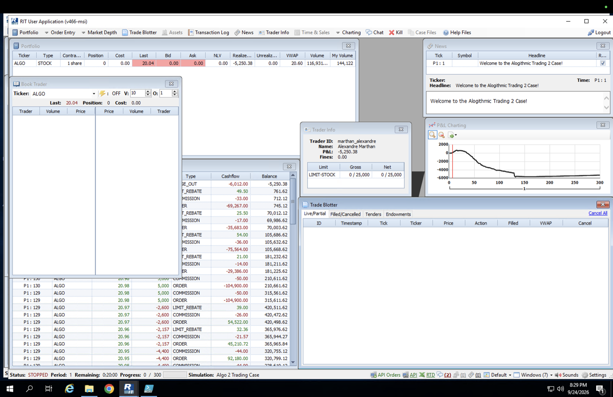
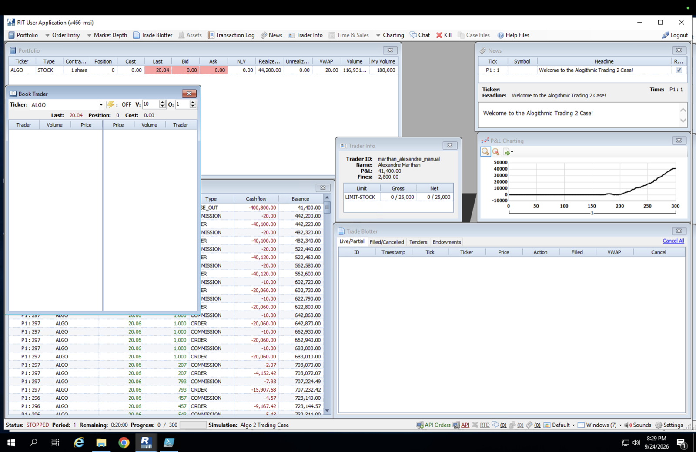

# Final Project Part 2.1: RIT ALGO2 Market Making Write-up

Alexandre Marthan · Individual write-up · Oct 7, 2026

Script: [`algo2_exploitative.py`](algo2_exploitative.py)

## Setup and economics

ALGO2 has one stock (ALGO), traded for 300 seconds. Orders are capped at 5,000 shares, and positions at 25,000 shares gross or net, with a 10¢-per-share fine beyond that. Market orders pay a 1¢ commission; filled limit orders receive a ½¢ rebate.

| Per share, against the mid, at a 1¢ spread | Limit order (passive) | Market order (aggressive) |
| --- | --- | --- |
| Half the spread | +0.5¢ | −0.5¢ |
| Fee | +0.5¢ rebate | −1¢ commission |
| **Total** | **+1¢** | **−1.5¢** |

The case pays for providing liquidity, so the core of any strategy is to quote passively and keep inventory small. Since the whole class runs market makers on the same stock, the real competition is for the front of the queue: the first quote at the best price gets the noise flow.

## (a) What was your strategy going in?

I went in with a **competitive market maker**: a passive two-sided quoter built to win queue priority over the simpler market makers I expected most of the class to run (quotes at LAST or the mid ± a few cents, round sizes, fixed polling).

I started from a plain market maker that followed the brief's two rules (always have a bid and an ask in the market; keep inventory balanced) and added four tactics on top, each with an on/off switch:

1. **Penny-jump.** Quote 1¢ inside the best competing bid and ask, but never closer than 1¢ to my own fair value. Being alone at the best price puts me first in the queue, and the ½¢ rebate lowers my break-even spread below that of a bot that joins the touch.
2. **Better fair value.** Fair value = the top-of-book microprice (the mid weighted toward the thinner side) plus a short-term momentum term (1.5 × fast EMA − slow EMA). The aim was to lean my quotes with short-term price pressure instead of quoting around a stale mid.
3. **Pick-off.** When a competing quote sits on the wrong side of my fair value by at least 3¢ (which covers the 1¢ commission), take it with a marketable limit order at that price, up to 3,000 shares. This is a bet that stale quotes are stale for a reason: the price has already moved.
4. **Thin-side widening and trend guard.** If one side of the book has under 2,000 competing shares within 5¢ of the touch, widen my quote on that side by 2¢: I'm the only liquidity there, so I charge more for it. If the momentum signal exceeds 2¢, cut the size of the quote the trend would run over to a third.

I also randomised quote sizes (±35%, never a round lot) and loop timing, so my orders were harder for other bots to identify and trade ahead of. All orders are real, tradable orders: no spoofing, and nothing that tries to move the price.

## (b) How would you decide what the appropriate bid/ask spread should be? Should it be dynamic or static?

**Dynamic.** A static spread is wrong most of the time. If it is wide enough to be safe in a fast market, it sits behind the touch in a calm market and only fills when the price runs through it, which is the fill a market maker doesn't want. If it is narrow enough to fill in a calm market, it gets run over in a fast one.

**What a quote has to earn.** Each passive fill earns half my quoted spread plus the ½¢ rebate and loses the adverse selection: how far the price moves against me after I'm filled. The tightest spread worth quoting is the one where half the spread plus the rebate still covers the adverse selection I expect. That depends on the competition (how tight the touch is) and on how fast the price is moving, and both change during a case.

**How my script sets it.** Every loop, in this order:

| Input | Rule | Why |
| --- | --- | --- |
| Reference price | Microprice of the other traders' orders (mine removed) + 1.5 × momentum, minus the inventory skew | Quote around where the price is going, not where LAST printed; my own quotes must not set the price I quote around |
| Default | Fair ± 5¢ | Fallback when there is no one to compete with |
| Competition | 1¢ inside the best competing bid and ask | Win the front of the queue |
| Floor | Never closer than 1¢ to fair, and never crossing the other side | Always passive: earn the rebate, never pay the commission on a quote |
| Thin book | +2¢ on a side with under 2,000 competing shares near the touch | Charge more when I'm the only liquidity |
| Inventory | Fair shifts 4¢ per 10,000 shares against my position | Moves the centre of the spread, not its width (see (d)) |

So the width is set mostly by the competition (penny-jump) and by how thin the book is, and the centre by fair value and inventory. The graded case showed what this rule set misses: the spread did not widen with the **speed** of the market. In a trend, a 1¢ half-spread around a fair value that lags the price does not cover the adverse selection, and penny-jumping makes my quote the first one the trend fills.

## (c) What happened during the simulation? What was your size strategy? Please share your Python script with an explanation on how to use it.

### What happened

The graded case (24 Sep 2026) was a trend day, not the range-bound market of the practice cases. The price rose from about $20.00 to about $21.26 by tick 160, then fell back to $20.04 at the close.

*RIT client at the end of the graded case: P&L chart (right), final P&L and fines (Trader Info) and the end of the transaction log.*

- **Ticks 0–20: the strategy worked.** In a calm market, penny-jumping got my quotes filled first, and P&L rose to about +$800 from spread and rebates.
- **Ticks 20–130: steady loss.** As the rally built, buyers took the offers, and the offer at the front of the queue was mine. I kept selling into the rise. The inventory skew (4¢ per 10,000 shares) and the size shrink only slowed it. P&L fell steadily to about −$4,000.
- **Ticks 129–130: covering the short.** The log shows passive sells of 2,600, 2,157 and 4,400 shares at $20.95–$20.97 (each with a rebate), then two 5,000-share buys at $20.98 that crossed the spread and paid the 1¢ commission. P&L dropped to about −$5,500 at that point.
- **Ticks 130–300: flat.** With inventory back near zero, the market maker roughly broke even through the fall, and the small residual was closed out by RIT at the end of the case.

**Why the defences didn't fire.** The momentum signal and the trend guard were designed for short bursts. The slow EMA has a horizon of a few seconds, so a steady trend of about 0.8¢ per tick reads as only about 1.5–3¢. That is around the 2¢ threshold, so the trend guard flickered on and off instead of staying on. The drawdown stop was set at $8,000 below the peak NLV; my worst drawdown was about $6,300, so it never triggered and the pick-off kept running. The pick-off itself is a momentum bet: it buys asks that look cheap against a fair value that leans with the trend, which helps only if the trend continues.

### Size strategy

- **Quote size: about 3,000 shares per side**, randomised ±35% and never a round lot. That is large enough to matter at the touch and well under the 5,000-share order cap.
- **The side that grows inventory shrinks linearly** to 0 at 18,000 shares.
- **Hard cap of 22,000 shares:** no quote or pick-off can take the position past it, 3,000 shares under the 25,000 limit, so the algorithm cannot be fined.
- **Pick-offs: at most 3,000 shares**, at least 0.5 s apart, so it doesn't chase a move.

The algorithm traded 144,122 shares in the case with no fines.

### The script ([`algo2_exploitative.py`](algo2_exploitative.py))

The script runs one loop about every 0.1 s through the RIT REST API:

1. **Read the book** (20 levels) and remove my own orders by trader ID.
2. **Fair value:** microprice of the remaining top level, plus 1.5 × (fast EMA − slow EMA).
3. **Drawdown check** every 2 s: if NLV falls $8,000 below its peak, switch to defensive mode (quote only the side that reduces inventory, no pick-offs, no penny-jumping).
4. **Pick-off:** if a competing quote is at least 3¢ on the wrong side of fair, take it with a marketable limit order and cancel any unfilled remainder right away.
5. **Quote:** compute the target bid and ask from the rules in (b) and the sizes from the rules above. Keep a resting order if it is already at the target price (to keep its queue position); otherwise cancel and repost.
6. **Log:** every 0.5 s, write every resting order in the book with its trader ID to a CSV. At the end, print a summary per trader (typical size, distance from the mid, how often they requote), used to tune the parameters after practice rounds.
7. **End of case:** from tick 295, cancel everything and stop quoting.

**How to use it**

1. `pip install requests`
2. Open the RIT client, load the ALGO2 case and enable the API. Check the port and API key in the API panel of the status bar.
3. Paste the key into `API_KEY` and check `BASE_URL` (default `http://localhost:7238/v1`) at the top of `algo2_exploitative.py`.
4. Run `python algo2_exploitative.py` before the case starts. It waits for the case to become ACTIVE, trades until tick 295 and writes the book log to `logs/`.
5. Each tactic can be switched off at the top of the file (`PENNY_JUMP`, `PICKOFF`, `THIN_WIDEN`, `TREND_GUARD`, `OBFUSCATE`, `BOOK_LOG`). With all of them off, it is a plain inventory-skewed market maker.
6. Ctrl+C stops the loop but does **not** cancel orders or flatten: cancel and check the position in the RIT client afterwards.

| Setting | Value | Role |
| --- | --- | --- |
| `BASE_SIZE` / `SIZE_JITTER` | 3,000 / ±35% | Quote size per side |
| `MIN_HALF_SPREAD` / `MAX_HALF_SPREAD` | 1¢ / 5¢ | Closest quote to fair / default quote |
| `JUMP` | 1¢ | How far inside the best competing quote |
| `EMA_FAST` / `EMA_SLOW` / `MOMENTUM_BETA` | 0.35 / 0.05 per loop / 1.5 | Momentum term in fair value |
| `TREND_THRESH` | 2¢ | Trend guard on above this |
| `PICK_EDGE` / `PICK_MAX` / `PICK_COOLDOWN` | 3¢ / 3,000 shares / 0.5 s | Pick-off |
| `THIN_DEPTH` / `THIN_EXTRA` | 2,000 shares / 2¢ | Thin-side widening |
| `SKEW_PER_SHARE` | 4¢ per 10,000 shares | Inventory skew |
| `SOFT_LIMIT` / `HARD_LIMIT` | 18,000 / 22,000 shares | Size shrink / hard cap |
| `MAX_DRAWDOWN` | $8,000 | Defensive mode |
| `STOP_QUOTING_TICK` | 295 | Cancel everything |

## (d) What are the different ways you can alter your trading strategy, so that you keep submitting orders but attempt to balance your book?

The aim is to keep quoting, so I keep earning the spread and the rebate, while making the fill that reduces my inventory more likely than the fill that adds to it. The levers I used first:

1. **Skew both quotes against the position (used: 4¢ per 10,000 shares).** When short, raise both the bid and the ask, so the bid fills more and the ask less. In the graded case it was too weak: a few cents against a $1.26 move.
2. **Shrink the side that adds to the position (used: to 0 at 18,000 shares).** Each fill then moves the position toward zero even when both sides trade.
3. **Hard cap (used: 22,000 shares).** Rules out the fine and rejected orders.
4. **Shrink the side a trend runs into (used: trend guard, size ÷ 3 above a 2¢ signal).** The right idea, but the signal was too short-horizon to stay on in a slow, steady trend (see (c)).
5. **Quote only the reducing side after a drawdown (used: defensive mode at $8,000).** Set too loose to trigger in this case.
6. **Give the reducing side priority (partly used).** Penny-jumping the reducing side puts it alone at the front of the queue. I applied it to both sides; applying it to the reducing side only, and quoting the adding side behind the touch, would balance faster.
7. **Unwind before the end (not used).** From about tick 270, quote only the reducing side passively, then close the rest with market orders in the last few ticks instead of relying on RIT's close-out.
8. **Pay to exit when a position goes against me (not used).** Close part of the position with a market order once the price is several cents past the average entry. Paying 1.5¢ per share early is much cheaper than holding a short through a 1¢-per-tick rally.

Levers 1 to 5 are passive: they make the reducing fill more likely, but in a trend that fill doesn't come, because the flow is all on one side. The fixes I would make are a longer-horizon trend signal for lever 4, a tighter drawdown stop for lever 5 (about $2,000), and lever 8.

## (e) Will market-making strategies typically work in a trending market?

**Usually not**, and my graded case is an example.

A market maker earns a small amount per round trip, about 2¢ per share here, and needs flow on both sides so that both legs fill. In a range, buyers and sellers alternate and inventory comes and goes. In a trend the flow is one-sided: in a rally, buyers take the offers, so the quote that fills is the ask, leaving the market maker short just before the price rises further. Spread income grows with the number of fills; the inventory loss grows with the size of the move.

Penny-jumping makes this worse. Being first in the queue is an advantage in a range, because I get the noise flow before the other market makers. In a trend, it means I am the first one filled by the informed flow. My P&L shows both: +$800 in the calm first 20 ticks, then a steady loss as the price trended.

The comparison with my manual account in the same case makes the same point from the other side. Trading by hand with the trend, I made **+$41,400** (after $2,800 of fines for going over the position limit). In a trending market, the profitable position is directional, which is the opposite of what a market maker ends up holding.

*Manual account (`marthan_alexandre_manual`) in the same case, for comparison: P&L +$41,400 after $2,800 in fines.*

**When it can still work:** only if the market maker stops being symmetric in a trend. It needs a trend signal on the horizon of the trend (tens of ticks, not seconds), and when it fires it should stop quoting the side the trend runs into and close inventory held against the trend. Back in a range, it resumes two-sided quoting.

## (f) What was your P&L?

My algorithm's P&L for the graded case was **−$5,250.38**, with **no fines**, on 144,122 shares traded. It was about +$800 after the first 20 ticks, fell to about −$5,500 by tick 130 as the algorithm held a short through the rally, and recovered slightly over the rest of the case.

For comparison, my manual account in the same case ended at +$41,400 after $2,800 of fines.

## Files in this folder

| File | What it is |
| --- | --- |
| `RIT_ALGO2_Writeup_Alex.md` | This write-up |
| [`algo2_exploitative.py`](algo2_exploitative.py) | The market-making script used in the graded case (API key removed) |
| `figures/fig1_algo_session.png` | RIT client at the end of the graded case, algorithm account |
| `figures/fig2_manual_session.png` | RIT client at the end of the same case, manual account |
